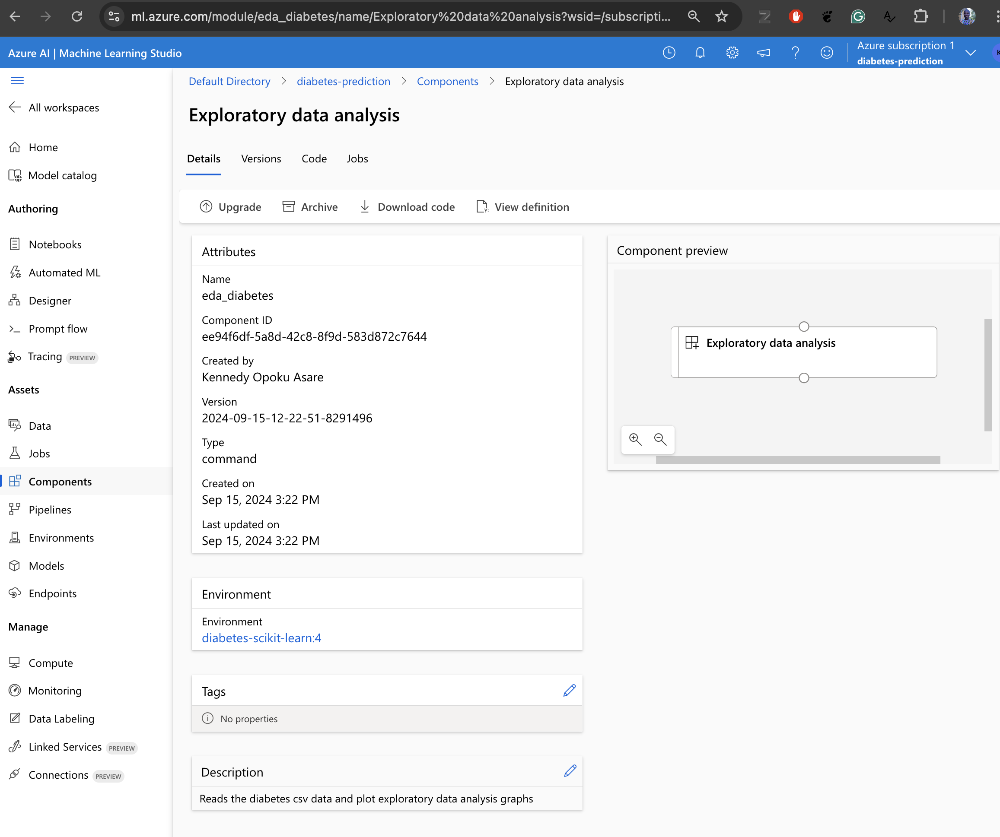
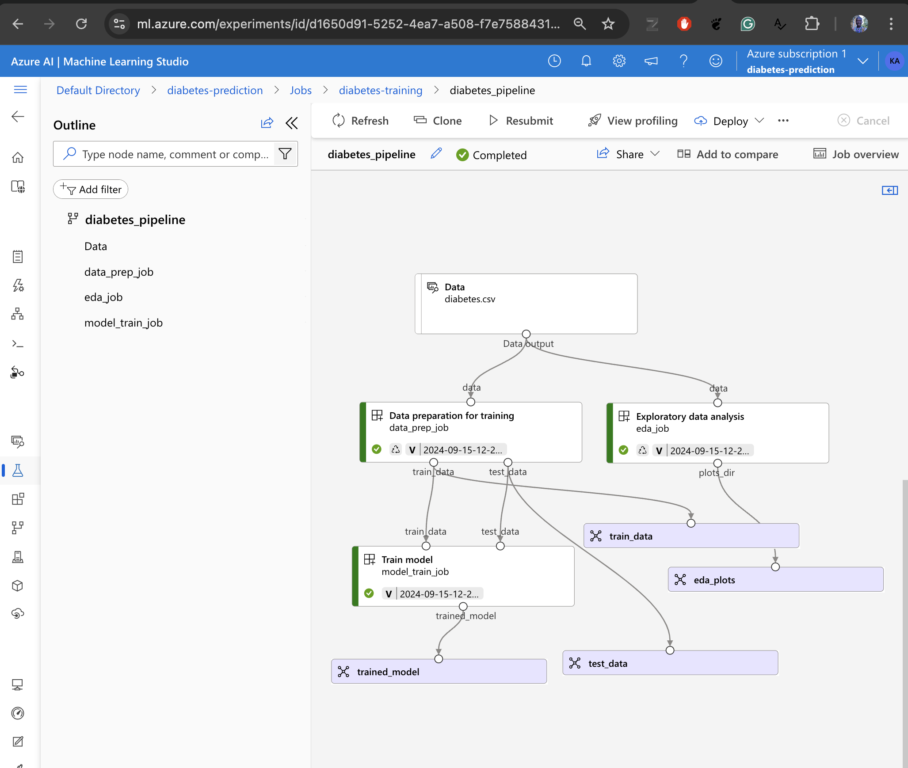
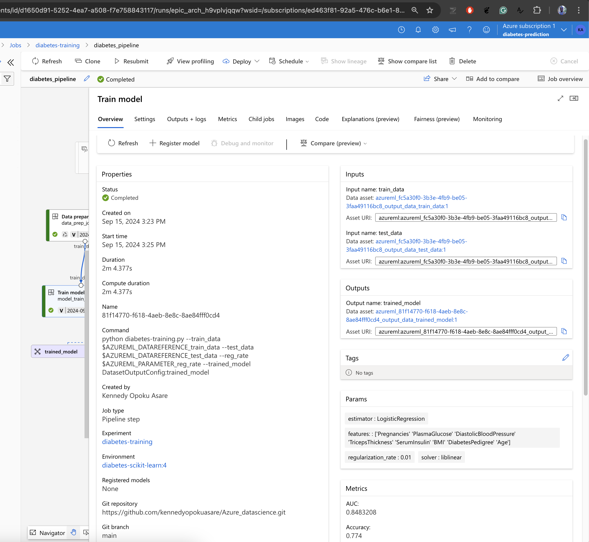
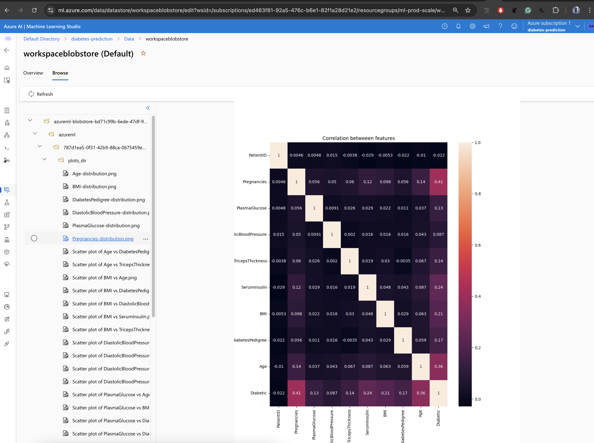
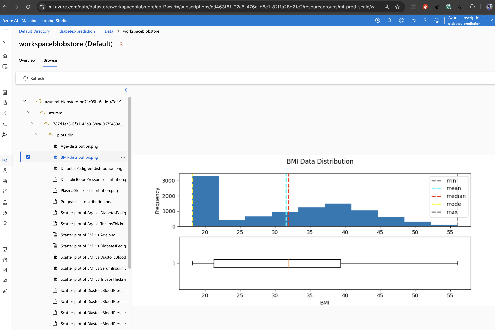

# Machine Learning with Microsoft Azure

**Microsoft Azure Machine Learning** provides the cloud infrastructure, DataStores, scalable and on-demand compute, machine learning workflows for production-grade Machine Learning. Azure offers tools for the full lifecycle of Machine Learning, including the productionization and monitoring of models.

In previous Machine Learning work [[1](https://github.com/kennedyopokuasare/IBM_datascience), [2](https://github.com/kennedyopokuasare), [3](https://github.com/kennedyopokuasare/carat-analysis)], I have executed entire machine learning pipelines, from data cleaning to prediction, using my personal computer, Jupyter Notebook, and [Snakemake for workflow management](https://snakemake.readthedocs.io/en/stable/). There are bottlenecks when training machine learning models with large datasets on a personal computer with limited resources, especially when multiple experiments need to be conducted — a case in point is when I trained [five machine learning algorithms to predict the depression status of participants](https://www.sciencedirect.com/science/article/pii/S1574119222000566) as part of my PhD research.

This repository presents a project where I use Microsoft Azure Machine Learning Cloud services for training, inferencing and Productionization of Machine Learning Models.

## Exploratory Data Analysis

In `Azure ML Studio`, notebooks can be run just like you would on your computer. First, you need to provision a `compute instance` that will run the computations in the notebook.

For instance:

* I explored the student grades and hours of study dataset and examined the distribution of the students' grades. [Source](./With_code/02-visualize-data.ipynb)
* I used the K-Means clustering algorithm to cluster the seeds dataset based on two principal components of the dataset. [Source](./With_code/01-clustering-introduction.ipynb)

## Automated Machine Learning in Azure ML studio

`Automated Machine Learning` allows for automated training of multiple machine learning models, in parallel to predict a target, without the need to write code. AutoML selects the best models and data transformations based on a the estimator's metrics.

### AutoML completed, with MaxAbsScaler and XGBoostRegressor

In the screenshot, the AutoML selected the best model `XGBoostRegressor` with `MaxAbsScaler`based on metrics such as the `Normalized root mean square error`. The registered and deployed with a Real time endpoint.


### Explaining the AutoML regression model

For model explanability, the AutoML generates the feature importance for all features. It is possible to show the best K features usign the UI. In the screen shot, `workingday`, `temperation`, `year` and `humidity` were the best 4 features that explained the prediction of bicyle rentals.  


Several metric to access the performance of the model is generated by AutoML. The AutoML also generates plots such as the Redisual plots for Regression models that can be use to qualitatively access the model's performance.


## Designing ML pipelines with low code drag and drop UI

### Setup the datasource


### Design classification pipeline

#### Designing a Logistic Regression classifier


#### Comparing Logistic Regression and Decision Forest classifiers


#### Evaluation metrics of the Logistic Regression and Decision Forest classifiers


### Inferencing with the trained model


### Deploy model and test

```python
import requests
import json

endpoint = "<END-POINT-URL-HERE>"
key = "<API-KEY-HERE>"

payload = {
    "Inputs": {
        "input1":
        [
            {
                'Age':43,
                'PatientID': 1882185,
                'Pregnancies': 9,
                'Glucose': 104,
                'BloodPressure': 51,
                'SkinThickness': 7,
                'Insulin': 24,
                'BMI': 27.36983156,
                'DiabetesPedigreeFunction': 1.3504720469999998
            },
        ],
    },
}

#Set the content type and authentication for the request 
headers = {"Content-Type":"application/json", "Authorization":"Bearer " + key} 
input_json = json.dumps(payload)

#Send the request 
response = requests.post(endpoint, input_json, headers=headers) 
response.text

if response.status_code == 200: 
    y = response.json()  
    output = y["Results"]["WebServiceOutput0"][0]
    print("Predictions:") 
    print('Patient: {}\nPrediction: {}\nProbability: {:.2f}'.format(
        output["PatientID"],
        output["DiabetesPrediction"],
        output["Probability"]
    ))
else: 
    print(response) 
```

```txt
Predictions:
Patient: 1882185.0
Prediction: 1.0
Probability: 0.75
```

## Building and Operating Experiments

In most cases, production systems intergrate Azure Machine Learning into existing code bases. Therefore, the ML Designer and AutoML may not be the ideal choice in such instances. The Azure Machine Learning Python SDK provides creating scripts that can be use build and operate Machine Learning systems. For aditional details, see the [What is the Azure Machine Learning SDK for Python](https://learn.microsoft.com/en-us/python/api/overview/azure/ml/?view=azure-ml-py) guide.

In this [source](./Build_Operate/experiments_with_scripts/01-Runing-experiments-on-azure-with-scripts.ipynb), I use Azure Machine Learning Python SDK to create an Experiment, configure and run a script that uses LogisticRegresion to predict diabetic status, and Registers the model output in an Azure Machine Learning workspace.

### Experiment job run

Submit a Job to run the diabetes-training.py script.  "Test data size (`test_size`) and Regularization rate (`reg_rate`) for the `LogisticRegression` are passed as parameters. Registed `diabetes_csv` data is also passed as parameter to the script


```python
from azure.ai.ml import command, Input
from azure.ai.ml.constants import AssetTypes, InputOutputModes

data_asset = ml_client.data.get("diabetes_csv", version="1.0.0")

# Define arguments / parameters
diabetes_data = ml_client.data.get("diabetes_csv", version="1.0.0")
test_size = 0.30
reg_rate = 0.01

run_command = command(
    code="./src",
    command="python diabetes-training.py --data ${{inputs.data}} --test-size ${{inputs.test_size}} --reg-rate ${{inputs.reg_rate}} ",
    inputs=dict(
        data= Input(
            path=diabetes_data.id,
            type=AssetTypes.URI_FILE,
            mode=InputOutputModes.RO_MOUNT,
        ),
        reg_rate = reg_rate,
        test_size = test_size,
    ),
    environment="diabest-train:5",
    experiment_name = "diabetes-training"
)

returned_job = ml_client.jobs.create_or_update(run_command)
```


### Registering a model

```python
import sklearn
from azureml.core import Model

filename = 'outputs/model.pkl'

run.register_model(
    model_name="diabetes-classification-model",
    model_path = filename,
    description = "A LogisticRegression classification model for Diabetes",
    tags = { 'data-format':"CSV", "regularization-rate":reg_rate, "test-size": test_size},
    model_framework = Model.Framework.SCIKITLEARN,
    model_framework_version = str(sklearn.__version__)
)
```


## Creating components and a Pipeline

Azure ML has APIs for using custom code to create components,  that can be used to build a Machine Learning pipeline. These components are similar to the ML Designer drag and drop UI compents.

In this [notebook](./Build_Operate/pipelines/01-orchestrating-pipelines-with-azure-ml.ipynb), I create an end to end pipeplines for data preparation, exploratory data analysis and model training.

To create pipelines, `Components` needs to be created, and optionally registered for reuse. For example the the component scripts needs to be created and written to a file.

```python
%%writefile {components_dirs["eda"]}/diabetes-exploratory-plots.py
# Plot distrubtions step

import pandas as pd
import seaborn as sns
import os
import matplotlib.pyplot as plt
from itertools import combinations
import argparse

# Create a function that we can re-use
def plot_correlations(data,output_path="outputs"):
    """
    This function will make a correlation graph and save it
    """
    correlation = data.corr()
    print("Correlation between features\n", correlation)

    fig = plt.figure(figsize=(10, 12))
    sns.heatmap(data=correlation, annot=True)
    plt.title("Correlation betweeen features")

    # Save plot
    filename = os.path.join(output_path, "correlations-between-features.png") 
    fig.savefig(filename)

def main():
    print("Loading Data...")

    parser = argparse.ArgumentParser()
    parser.add_argument('--data', type=str)
    parser.add_argument('--plots_dir', type=str)
    args = parser.parse_args()

    diabetes = pd.read_csv(args.data, header= 0)

    # plot correlations
    plot_correlations(data=diabetes, output_path = args.plots_dir)

if __name__ == "__main__":
    main()

```

The script is then used to create a component, where you specify the inputs and outputs of the component, the command to run the python script and other component properties. 

```python

eda_command = command(
    name="eda_diabetes",
    display_name="Exploratory data analysis",
    description="Reads the diabetes csv data and plot exploratory data analysis graphs",
    inputs=dict(data=Input(type="uri_file")),
    outputs=dict(plots_dir=Output(type="uri_folder", mode="rw_mount")),
    code=components_dirs["eda"],
    command="python diabetes-exploratory-plots.py --data ${{inputs.data}} --plots ${{outputs.plots_dir}}",
    environment=command_env,
    experiment_name=experiment_name,
)

# Now we register the component to the workspace
eda_command_component = ml_client.create_or_update(eda_command.component)

# Create (register) the component in your workspace
print(
    f"Component {eda_command_component.name} with Version {eda_command_component.version} is registered"
)

```

The `Component` will then be registed in the workspace (Azure ML studio)



 Multiple components can then be used to create a Pipeline. 

 


| Complete Train step and logged metrics  | Distribution and Correlation plot from EDA step  |
|---|---|
| | |   
| | |  
